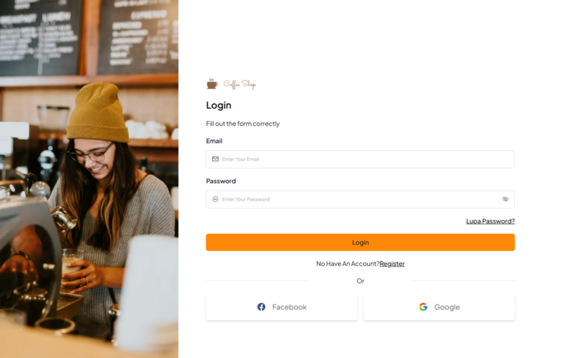
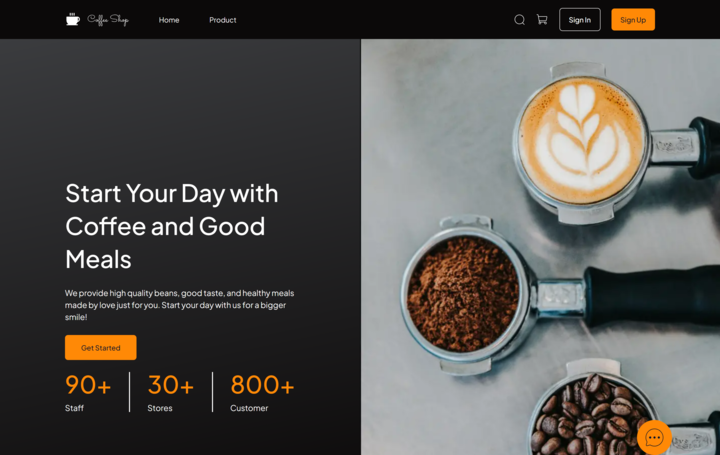
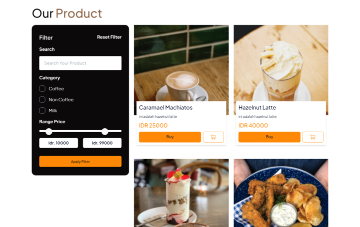
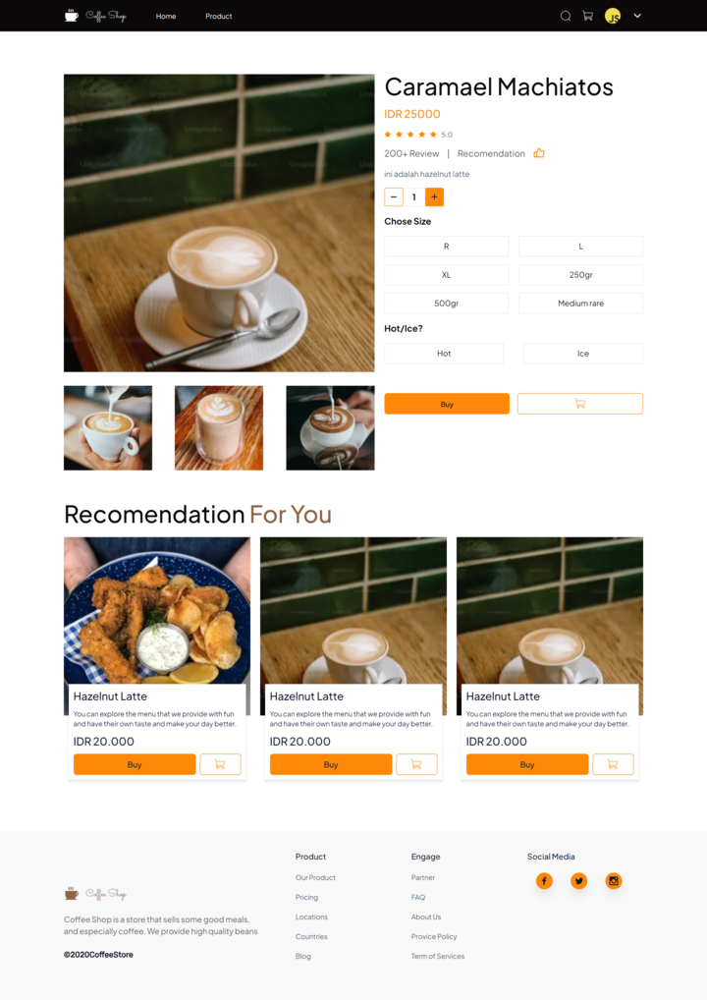
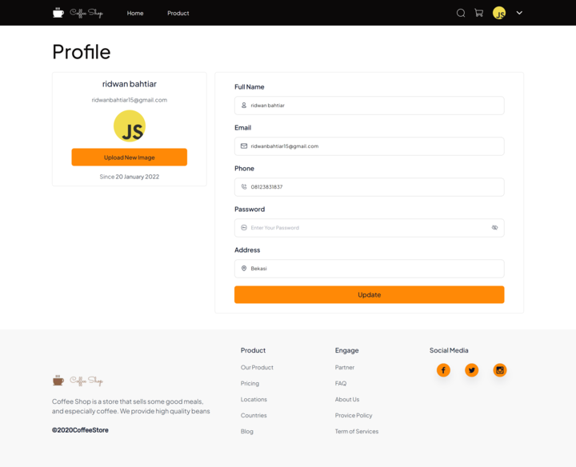
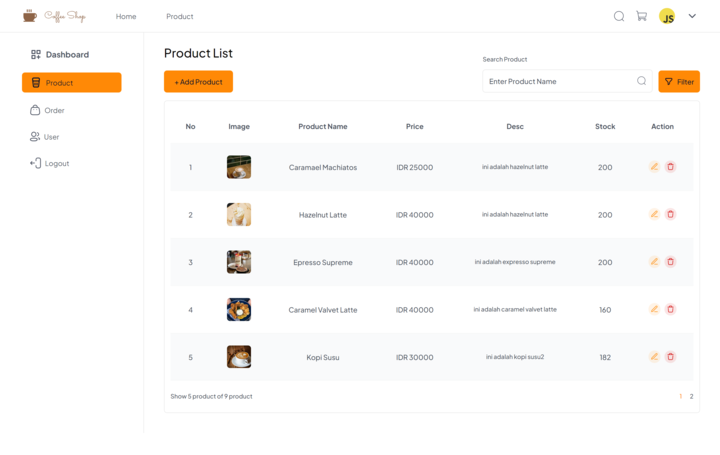

# Coffee Shop With React JS

<!-- ABOUT THE PROJECT -->

</img>

A Front End project for ordering coffee and transactions online. The main feature in this project is using a Single Page Application (SPA), Dynamic Web and Responsive website for mobile, tablet and laptop.

## Link Deployment

https://coffee-shop-react-vite.vercel.app/

## Built With

- [![ReactJs][ReactJs-logo]][ReactJs-url]
- [React JS](https://go.dev/)
- [Tailwind CSS](https://tailwindcss.com/)
- [Redux](https://redux.js.org/)
- [Chart JS](https://www.chartjs.org/)

## Configure app

Create file `.env` then edit it with your settings
according to your needs. You will need:

| Key               | Value                                 |
| ----------------- | ------------------------------------- |
| VITE_BACKEND_HOST | Your Backend Express JS / Golang Host |

## Install And Run Locally

1.  Clone project from github repository

        $ git clone https://github.com/ridwanbahtiar15/coffee-shop-react-vite.git

2.  go to folder coffee-shop-react-vite

        $ cd coffee-shop-react-vite

3.  install dependencies

        $ npm install

4.  Prepare Backend

        # prepare the backend in the following link [Back End With Express JS](https://github.com/ridwanbahtiar15/coffe-shop) or [Back End With Golang](https://github.com/ridwanbahtiar15/coffee-shop-Golang)

5.  Start the server

        $ npm run dev

## Screenshot

| Login                                                                                | Home                                                                                        |
| ------------------------------------------------------------------------------------ | ------------------------------------------------------------------------------------------- |
|    |            |
| ----------------------------------------------------------------------------------   | -----                                                                                       |
| Product                                                                              | Product Detail                                                                              |
| ----------------------------------------------------------------------------------   | -----                                                                                       |
|  |  |
| ----------------------------------------------------------------------------------   | -----                                                                                       |
| Profile                                                                              | List Product                                                                                |
| ----------------------------------------------------------------------------------   | -----                                                                                       |
|  |    |

## Related Project

[Back End With Express JS](https://github.com/ridwanbahtiar15/coffe-shop)

[Back End With Golang](https://github.com/ridwanbahtiar15/coffee-shop-Golang)
